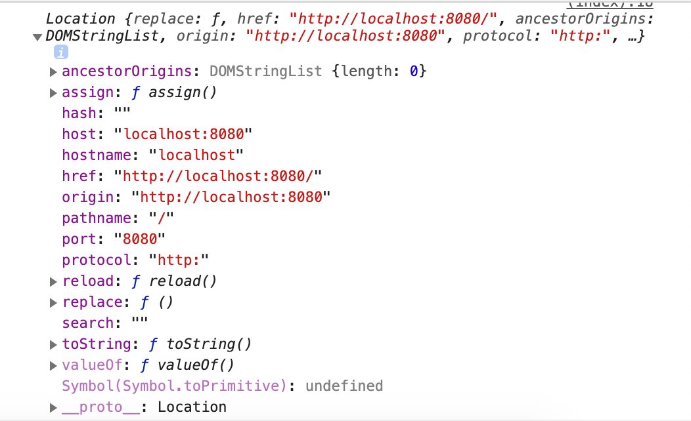
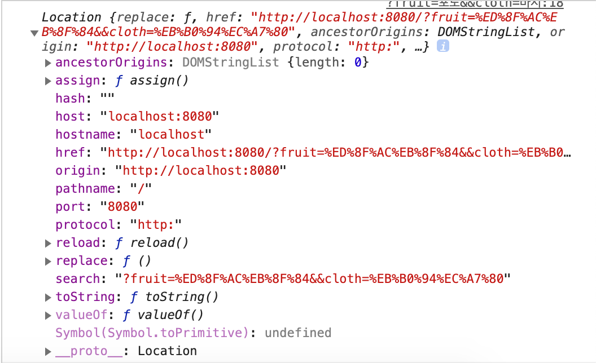

# Single Page Application & Routing

## 시나리오.1 - 기본 주소로 접근하는 경우 `("/")`

> SPA(Single Page Application) 개발을 하게 되는 상황에서는 각 페이지 접근 상황마다 필요한 요소들을 다운받는 것이 아닌 첫 접근시에 필요한 모든 리소스를 내려받아 어플리케이션을 이용하는 동안 지속적으로 이용할 수 있게 하는 목적이다.

> 이를 통해 페이지 이동마다 리소스를 내려받는 트래픽을 없애고 렌더링 퍼포먼스도 향상 시킬 수 있다. 

1. 클라이언트는 서버에 접근
2. 서버는 어플리케이션에 필요한 모든 리소스를 전송
3. 클라이언트는 응답받은 리소스를 통해 어플리케이션을 렌더링
4. 클라이언트의 요청(Ajax)에 서버는 Data 단위로 응답.
5. 클라이언트는 Data를 통해 UI를 구성.

## 문제 상황

> 페이지마다 고유 URL을 갖던 기존 방식에서 SPA는 Ajax를 통한 렌더링을 수행하므로 URL 변경이 없다. 이러한 방식은 브라우저 History관리에서 첫 문제점이 생긴다.(뒤로가기, 앞으로가기)

## 해결 방안

> `PJAX` 방식의 처리를 이용.

- [브라우저 히스토리 조작하기](https://developer.mozilla.org/ko/docs/Web/API/History_API)

```javascript 1.6

    # 브라우저 히스토리 변경 이벤트 발생시 history.go() || history.back()
    window.onpopstate = () => {
      
      console.log(`POP STATE OCCURED : ${JSON.stringify(event.state)}`)
  
    }

    window.onload = () => {

      # 주어진 <a> 태그에 이벤트 부착.
      document.querySelectorAll('.pushStateLink').forEach((el) => {
        el.addEventListener('click',(event)=>{

          # <a> 태그의 페이지 이동 기본 이벤트 해제.
          event.preventDefault()
          
          # 쿼리문만 가져오기 위해 split()
          let targetHref = event.target.href.split("/")

          # 쿼리문의 &&를 기준으로 split()
          let queryChunks = targetHref[targetHref.length-1].split("&&")
          let pushStateData = queryChunks.reduce((acc,curr) => {
            
            # 하나의 쿼리를 Key Value 쌍으로 split()
            let KV = curr.split("=")

            if(!(KV[0] in acc)){
              acc[KV[0]] = KV[1]
            }

            return acc

          },{})

          # pushState()함수에 대입할 상태 Object확인
          console.log(pushStateData)

          # 브라우저 URL에 대입한다. pushState()되면서 뒤로가기 버튼이 활성화된다.
          window.history.pushState(pushStateData,"",`?fruit=${pushStateData.fruit}&&cloth=${pushStateData.cloth}`)

        })
      })

      
    }
  

<body>
  <a class="pushStateLink" href="fruit=사과&&cloth=남방">사과와남방</a>
  <a class="pushStateLink" href="fruit=포도&&cloth=바지">포도와바지</a>
  <a class="pushStateLink" href="fruit=복숭아&&cloth=모자">복숭아와모자</a>
</body>

```

[예제 소스](./public/examples/scenario_1.html)

<hr />

## 시나리오.2 - 첫 접근이 쿼리문이 입력된 상태로 시작되는 경우 `("/?fruit=사과&&cloth=남방")`

## 문제 상황

> `"/"` 경로로 접근했을때 index.html 파일을 응답하도록 설정해두면 쿼리문이 동반된 접근에 리소스를 응답해주지 못한다.

## 헤결방안

> 서버로 접근하게 되는 경우 접근하는 URL에 따라 전달하는 Data나 리소스를 결정할 수 있는데 Single Page Application의 경우에는 접근하는 모든 라우팅에 대해서 같은 리소스를 응답하도록 설정한다.

```javascript 1.6

  const app = require('express')()
  const path = require('path)
  const port = process.env.PORT || 8080
  
  app.use(express.static(__dirname + '/public'))

  # 모든 GET 요청에 대해
  app.get('*',(req,res) => {

    # index.html 파일을 응답해준다.
    res.sendFile(path.resolve(__dirname,'index.html'))

  })

```

[예제 소스(Server)](./app.js)  
[예제 소스(Client)](./public/examples/scenario_2.html)

> 클라이언트는 URL입력값을 읽고 쿼리문이 동반된 접근인 것을 확인하고 렌더링 할 수 있어야 한다. GET요청 쿼리문의 경우 '?' 기호를 통해 구분할 수 있고 window.location 객체를 분석하여 쿼리문이 동반된 접근인지도 확인가능하다.

기본 경로로 접근한 경우


쿼리를 동반하여 접근한 경우


> `search` 프로퍼티를 확인하여 렌더링 동작을 분기시키면 될듯 하다... 실천에 옮겨보자

> 이후 페이지 내에서 동작하는 요소들은 `pushState()`로 컨트롤 하며 `PJAX` 방식으로 통신 및 렌더링 된다.

<hr />

## 시나리오.3 - 자바스크립트 모듈 번들러를 이용하는 경우 `(Webpack)`

> `React.js` 라이브러리를 통해 `SPA`개발을 진행하게 되면 통상 `Webpack` 모듈 번들러를 통해 트랜스파일 및 번들링 작업을 진행한다. 결과물은 하나의 .js 파일로서 생성되는데 처음에 모든 필요 리소스를 전달하여 주는 SPA의 특성에 적합하다.

## 환경구성 

먼저 `npm` 패키지 매니저를 통해 필요 모듈들을 내려받는다.

```shell 
  $ npm init
```

```shell 
  $ npm install babel-loader @babel/core @babel/preset-env @babel/preset-react css-loader style-loader @babel/plugin-syntax-dynamic-import @babel/plugin-proposal-class-properties html-webpack-plugin clean-webpack-plugin webpack webpack-cli webpack-dev-server @gfx/zopfli compression-webpack-plugin --save-dev
```

```shell 
  $ npm install core-js regenerator-runtime react react-dom react-router-dom --save
```

개발 생산성 향상을 위해 webpack.config.js 파일을 작성한다.

```javascript

const webpack = require(`webpack`);
const path = require(`path`);
const HtmlWebpackPlugin = require('html-webpack-plugin')
const {CleanWebpackPlugin} = require('clean-webpack-plugin')
const CompressionPlugin = require('compression-webpack-plugin')
const zopfli = require('@gfx/zopfli')

module.exports = {
    mode : 'development',
    entry : path.join(__dirname,'Components','src','Root.jsx'),
    output : {
        filename : 'bundle.js',
        path : path.join(__dirname,'bundle')
    },
    devServer: {
		hot : true,
		contentBase: [			
			path.join(__dirname, `public`),
			path.join(__dirname, `Components`)],
		watchContentBase: true,
		historyApiFallback: true,
		compress: true,
		host: `0.0.0.0`,
		disableHostCheck: true,
		port: 9000,
	},
    devtool : 'inline-source-map',
    module : {
        rules : [
            {
                test : /\.(js|jsx)$/,
                exclude : /node_modules/,
                use : ['babel-loader']
            },
            {
                test : /.(css)&/,
                use : [
                    {
                        loader : 'style-loader'
                    },
                    {
                        loader : 'css-loader',
                    }
                ]
            },

        ]
    },
    plugins : [
        // new CompressionPlugin({
		// 	compressionOptions: {
		// 	  numiterations: 5,
		// 	},
		// 	algorithm(input, compressionOptions, callback) {
		// 	  return zopfli.gzip(input, compressionOptions, callback);
		// 	},
		// }),
        new CleanWebpackPlugin({}),
        new webpack.ProgressPlugin(),
        new HtmlWebpackPlugin({
            template : path.join(__dirname, 'public', 'index.html'),
            inject : true
        })
    ],
    target : 'web'
  }

```

npm 동작 스크립트는 다음처럼 작성하였다.

```javascript

  "scripts": {
  "test": "echo \"Error: no test specified\" && exit 1",
  "dev": "webpack-dev-server",
  "production": "webpack -p --optimize-minimize"
  }

```

> 이후 커맨드 실행창에 `npm run dev` 명령어를 입력하게 되면 소스 변경마다 번들링 되어 개발 서버에 반영되고 페이지가 리프레시 되는 것을 확인 할 수 있다. 

## 문제상황 

> 개발 서버가 아닌 실서버에서 제공해줘야 하는 경우.

## 해결방안

서버는 모든 GET 요청에서 같은 데이터를 응답하도록 설정

```javascript

  const express = require('express')
  const path = require('path')
  const port = process.env.PORT || 8080
  const fs = require('fs')
  let app = express()

  app.use(express.static(__dirname + '/public'))

  app.get('*',(req,res) => {

    fs.readFile(path.resolve(__dirname,'public/','index.html'),{
      encoding : 'utf-8'
    },(err,data) => {
      if(err){console.log(err)}
      res.send(data)
    })
    
  })

  app.listen(port,()=>{
    console.log(`PORT : ${port}`)
  })

```

단일 페이지는 Webpack Output인 bundle.js를 등록

```html

  <!DOCTYPE html>
  <html lang="en">
    <head>
      <meta charset="UTF-8">
      <meta name="viewport" content="width=device-width, initial-scale=1.0">
      <meta http-equiv="X-UA-Compatible" content="ie=edge">
      <title>Document</title>
    </head>
    <body>
      <div id="root"></div>
      <script src="./bundle/bundle.js"></script>
    </body>
  </html>


```

React-Router 라우팅 설정은 다음과 같이 설정한다.

```javascript 1.6

  class Root extends React.Component {
  render() {
    return (
      <Router>
        <div>
          <Navigator />
          <Switch>
            <Route exact path="/" component={Index} />
            <Route path="/about" component={About} />
            <Route path="/users" component={Users} />
            <Route path="/login" component={Login} />
            <Route component={NotFound} />
          </Switch>
        </div>
      </Router>
    )
  }
}

```

> 정확히 `"/"` 경로로 접근한 경우에만 Index 컴포넌트를 렌더링하고 라우팅 설정에 없는 경로로 접근한 경우
`NotFound` 컴포넌트를 렌더링 하도록 지시하였다. 나머지 경로에 쿼리문을 추가하여 접근하게 되면 설정한 컴포넌트는 렌더링 되고 쿼리문에 대한 정보는 컴포넌트의 `props`에 내장되어 있다. 우리는 내장된 `props.match` , `props.location` , `props.history` 객체들을 통해 쿼리에 따른 동적 렌더링이나 브라우저 히스토리를 조작할 수 있을 것이다.

### References

- [SPA와 라우팅](https://heecheolman.tistory.com/41)
- [Single Page Application & Routing](https://poiemaweb.com/js-spa)
- [WindowEventHandlers.onpopstate](https://developer.mozilla.org/ko/docs/Web/API/WindowEventHandlers/onpopstate)
- [A node.js SPA server](https://gist.github.com/ryanoglesby08/1e1f49d87ae8ab2cabf45623fc36a7fe)
